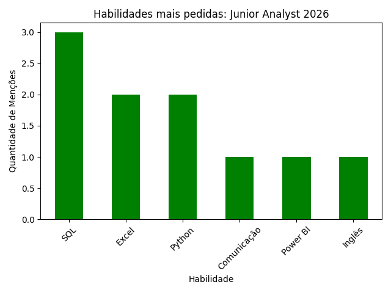

# Analisador de Vagas Júnior 📊

Script em Python para análise de tendências de mercado para **Junior Analyst**.

Este projeto foi desenvolvido para analisar as competências mais requisitadas em vagas de **Junior Analyst**.

## 🛠 Tecnologias
- **Python 3.12**
- **Pandas** (Tratamento de dados)
- **Matplotlib** (Visualização de dados)

## 📈 Resultado
O script gera um gráfico que ajuda a identificar visualmente quais ferramentas são prioridade para o mercado de análise atual.

*(Exemplo: Top skills como SQL, Python e Excel em vagas júnior – gere o seu rodando `python main.py`!)*

## 🚀 Como Usar
1. Clone o repo: `git clone https://github.com/Brunnacosta/analise-vagas-junior.git`
2. Crie/ative venv: `python -m venv venv` e `venv\Scripts\activate` (Windows).
3. Instale deps: `pip install pandas matplotlib`
4. Rode: `python main.py` (gera o CSV de dados e o PNG).

## 📝 Próximos Passos
- Adicionar scraping de vagas reais (ex: LinkedIn via API).
- Dashboard interativo com Streamlit.

Feito com ❤️ por [Brunnacosta](https://github.com/Brunnacosta).
